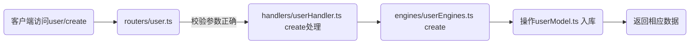

  <h1>node-mysql-koa2</h1>

  <p>使用完整的ES2015+功能开发Node.js应用程序，支持TypeScript。</p>

## 项目简介

- 本项目是一个使用Node.js➕MySQL➕Koa2编写的轻量级Web后端框架
- **MySQL**使用[Sequelize](https://github.com/sequelize/sequelize)
- api文档使用**swagger**自动生成
- 使用**MVC**模式，简单封装，易扩展，可供新手学习，也可以快速上手二次开发
- 目前实现的demo有：创建用户和获取用户列表。
- 具体文件结构介绍见**文件结构及说明表**

## 环境准备

- Install [Node.js 16.15.1+](https://nodejs.org/en/)
- Install [mysql server v8.0.19+](https://www.mysql.com/)

## 克隆项目

```sh
$ git clone --depth=1 https://github.com/updata7/node-mysql-koa2.git
```

## 安装依赖

```sh
$ cd node-mysql-koa2
$ npm install
```

## 编译

```sh
$ npm run build
```

## 运行

```bash
$ npm run dev
```

## 单元测试

```bash
$ npm run test
```

## 生成测试报告

```bash
$ npm run cover
```

## 接口文档（自动生成）

- 本地浏览器打开网址：http://localhost:9091/api/docs

## 文件结构及说明表:

| 文件名                | 描述                                                         |
| --------------------- | ------------------------------------------------------------ |
| **src/config**        | 环境配置文件，有生产环境和开发环境，如端口号、MySQL、Redis、Mongo等设置 |
| **dist**              | 存放编译后的文件                                             |
| **node_modules**      | 所有npm依赖项                                                |
| **src**               | 编译到dist目录的源代码                                       |
| **src/middlewares**   | 拦截请求的中间件，路由头部统一处理等                         |
| **src/models**        | 存储和检索Mysql数据，对标表结构，文件命名格式为：xxModel.ts，如数据库表名user,文件名为userModel.ts |
| **src/engines**       | 通过模型(models)直接操作数据库                               |
| **src/handlers**      | 用于路由器和调用engines里对应的模块                          |
| **src/routers**       | 存放客户端访问的路由文件，使用Joi进行参数验证，可限制接口get、post、put等请求方式，并且在此定义handler，即处理接口的入口函数 |
| **src/swaggers**      | Swagger UI for API                                           |
| **src/utils**         | Some common internal interfaces                              |
| **src/bin/server.ts** | Entry point to your Koa project                              |
| **src/app.ts**        | The helper file be used by server.ts                         |
| package.json          | 包含npm依赖项以及 [build scripts](#what-if-a-library-isnt-on-definitelytyped) |
| tsconfig.json         | 编译用TypeScript编写的服务器代码的配置设置                   |

## 本项目提供的Demo说明



## 二次开发思路

* src/routers，存放路由，在改目录下的文件，会由swagger自动生成api文档，供前端访问
* src/handlers，提供路由处理入口，在routers下写的api，处理函数可通过 handler指定
* src/engines，涉及数据库操作的，可由handlers下的文件调用
* src/models，有新表时，需要在此文件夹下新建文件，对标表结构

* 文件命名检验同个模块的数据，统一命名，如角色功能，对应文件可分别为:

  ```mermaid
  graph LR
  A(routers/role.ts)-.-B(handlers/roleHandler.ts)
  B-.-C(engines/roleEngine.ts)
  C-.-D(models/roleModel.ts)
  ```

* 具体可看Demo：**user**

## License

* MIT

* 如果对你有帮助的话，请你点一个星星 star 鼓励我，或者您有更好的建议和意见，请提出来告知我，可以留言 Issues或加我微信。希望能够帮助到你学习！Thanks！共勉！


